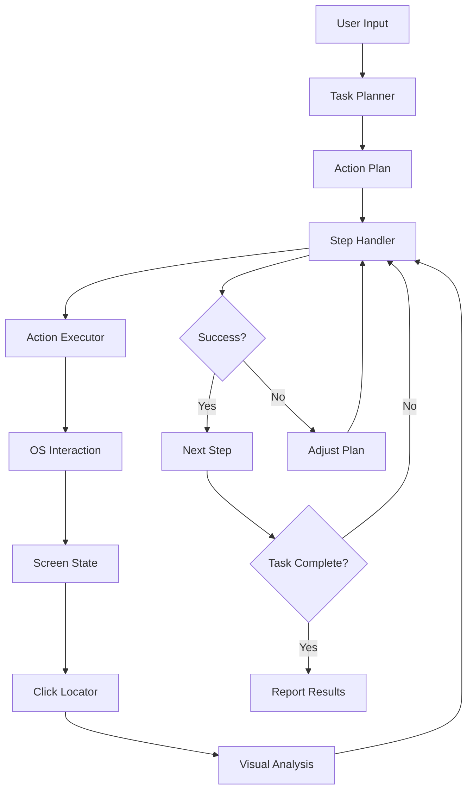

# TodoAI

<div align="center">

[](https://opensource.org/licenses/MIT)
[](https://www.python.org/downloads/)
[](./CONTRIBUTING.md)
[](https://ai.google.dev)
[](https://github.com/flxwld/TodoAI/stargazers)

<p align="center">
  
</p>

**Transform natural language into powerful computer automation**  
*Bridging the gap between human intention and digital execution*

[Key Features](#-key-features) •
[Demo](#-demo) •
[Installation](#-installation) •
[Usage Examples](#-usage-examples) •
[Architecture](#-architecture) •
[Contributing](#-contributing) •
[License](#-license)

</div>

## 📋 Overview

TodoAI is a groundbreaking AI-powered system that enables users to control their computers using natural language instructions. Our advanced deep learning model interprets commands, breaks them down into actionable steps, and executes them by analyzing the screen in real-time.

Unlike conventional automation tools, our agent:

- Requires **zero programming knowledge** from users
- Adapts to **changing screen layouts and application interfaces**
- Provides **detailed explanations** of its actions
- **Self-corrects and learns** from execution feedback

---

## 🌟 Key Features

<table>
  <tr>
    <td width="50%">
      <h3>🧠 State-of-the-Art AI</h3>
      <ul>
        <li>Powered by Google Gemini Pro and Vision API</li>
        <li>Advanced reasoning capabilities for complex tasks</li>
        <li>Contextual understanding of computer interfaces</li>
        <li>Self-improving through execution feedback loops</li>
      </ul>
    </td>
    <td width="50%">
      <h3>🗣️ Natural Language Interface</h3>
      <ul>
        <li>Intuitive task descriptions in everyday language</li>
        <li>No need for special syntax or commands</li>
        <li>Understands task context and user intentions</li>
        <li>Supports ambiguous and incomplete instructions</li>
      </ul>
    </td>
  </tr>
  <tr>
    <td width="50%">
      <h3>👁️ Visual Understanding</h3>
      <ul>
        <li>Real-time screen analysis and element recognition</li>
        <li>Identifies UI components across different applications</li>
        <li>Adapts to different screen resolutions and themes</li>
        <li>Robust to visual variations and layout changes</li>
      </ul>
    </td>
    <td width="50%">
      <h3>🛠️ Intelligent Task Execution</h3>
      <ul>
        <li>Automatically breaks complex tasks into manageable steps</li>
        <li>Dynamically adjusts plans based on execution feedback</li>
        <li>Handles unexpected application responses</li>
        <li>Provides detailed reasoning for each action taken</li>
      </ul>
    </td>
  </tr>
</table>

---

## 🎥 Demo

<div align="center">
  <a href="https://youtu.be/oRmwpc9fLd8" target="_blank">
    
  </a>
  <p><strong>Click the image above to watch our demo video on YouTube</strong></p>
</div>

---

## 📊 Market Impact

<div align="center">

| Metric | Traditional Automation | TodoAI |
|:------:|:----------------------:|:-------------------------:|
| Setup Time | 2-8 hours per workflow | 2-5 minutes |
| Learning Curve | Steep (requires coding) | Minimal (natural language) |
| Adaptability | Breaks when UI changes | Auto-adapts to changes |
| Maintenance | Regular updates needed | Self-maintaining |
| Accessibility | Technical users only | Available to everyone |
| Cross-Application | Limited support | Works across any visual interface |

</div>

> 💡 **Did you know?** Knowledge workers spend an average of 2.5 hours daily on repetitive tasks that could be automated, equivalent to 16 weeks per year of potential productivity gain.

---

## 🚀 Installation

### Prerequisites

- Python 3.10 or higher
- pip (Python package manager)
- Google Gemini API key
- Google Cloud Vision API credentials (optional for advanced image recognition)

### Quick Setup

```bash
# Clone the repository
git clone https://github.com/flxwld/TodoAI.git
cd TodoAI

# Create and activate a virtual environment
python -m venv venv

# On Windows:
venv\Scripts\activate

# On macOS/Linux:
source venv/bin/activate

# Install dependencies
pip install -r requirements.txt

# Set up environment variables
cp .env.sample .env
# Edit the .env file with your API keys
```

<details>
<summary>Detailed Configuration Options</summary>

You can customize the agent's behavior by editing `src/config.py`:

```python
# Example configuration snippet
GEMINI_API = {
    "model": "gemini-2.5-pro-preview-03-25",  # Choose your model version
    "temperature": 0.2,                       # Lower for more consistent outputs
    "top_p": 0.95,                            # Controls diversity
    "max_output_tokens": 1024,                # Maximum response length
}

UI = {
    "default_wait_time": 1.0,                 # Seconds to wait between actions
    "click_retry_count": 3,                   # Retry attempts for failed clicks
    "max_screenshot_width": 1920,             # Maximum width for screenshots
    "screenshot_quality": 80,                 # JPEG quality (1-100)
}
```

</details>

---

## 💻 Usage Examples

### Basic Usage

```bash
# Start the agent
python src/main.py

# Then describe your task in natural language
```

### Example Tasks

<details>
<summary>File Management</summary>

#### Command:
"Find all PDF files on my desktop that are older than 30 days and move them to an 'Archive' folder. Then create a text file with a list of the moved files."

#### Agent Actions:
1. Identifies the desktop location
2. Searches for PDF files
3. Checks file creation dates
4. Creates Archive folder if not exists
5. Moves qualifying files
6. Creates a detailed log file
7. Provides a summary of actions taken

</details>

<details>
<summary>Web Automation</summary>

#### Command:
"Go to Amazon, search for wireless headphones under $100 with at least 4 stars, and save the top 5 results to a spreadsheet with prices and ratings."

#### Agent Actions:
1. Opens the default browser
2. Navigates to Amazon
3. Enters search terms and applies filters
4. Extracts product information
5. Creates a new Excel spreadsheet
6. Organizes data in structured format
7. Saves the file to the desktop

</details>

<details>
<summary>Data Analysis</summary>

#### Command:
"Take a screenshot of this chart, extract the data points, and create a new chart showing the 3-month moving average."

#### Agent Actions:
1. Captures the screen region
2. Uses computer vision to identify data points
3. Extracts numerical values
4. Computes the moving average
5. Creates a new visualization
6. Displays results and saves output

</details>

---

## 🏗️ Architecture

TodoAI comprises six main components working together seamlessly:

1. **Task Planner**: Converts natural language instructions into structured execution plans using advanced LLM reasoning
2. **Action Executor**: Translates planned steps into computer interactions (mouse movements, clicks, keyboard inputs)
3. **Click Locator**: Uses computer vision to identify UI elements and determine precise interaction coordinates
4. **Step Handler**: Monitors execution progress, validates success, and provides feedback for plan adjustment
5. **AI API Integration**: Connects with Google Gemini and Vision APIs for intelligence and visual processing
6. **Execution Memory**: Maintains context across steps and enables learning from previous interactions

### Data Flow



---

## 🔒 Security & Privacy

Security is a fundamental aspect of our design:

- **No data persistence**: Task data is processed in memory and cleared after execution
- **Local processing**: Screen analysis happens on your device, not in the cloud
- **API isolation**: Each installation uses separate API credentials
- **Credential protection**: API keys are stored securely via environment variables
- **Scoped permissions**: TodoAI only requires access to what it needs to function

Read our detailed [security documentation](./docs/SECURITY.md) for more information.

---

## 👥 Contributing

We welcome contributions from developers, designers, documentation writers, and testers! 

<details>
<summary>Ways to Contribute</summary>

- **Code**: Implement new features or fix bugs
- **Documentation**: Improve docs or write tutorials
- **Testing**: Help test the agent across different platforms
- **Ideas**: Suggest new features or improvement areas
- **Bug Reports**: Submit detailed bug reports
- **User Experience**: Provide feedback on usability

</details>

See our [Contributing Guidelines](./CONTRIBUTING.md) for detailed information.

The project is currently maintained by [Felix Wald](https://github.com/flxwld) and contributors.

---

## 📜 License

This project is licensed under the MIT License - see the [LICENSE](LICENSE) file for details.

---

<div align="center">

**TodoAI** — *Turning words into digital actions*

[⬆ Back to top](#todoai)

</div>
